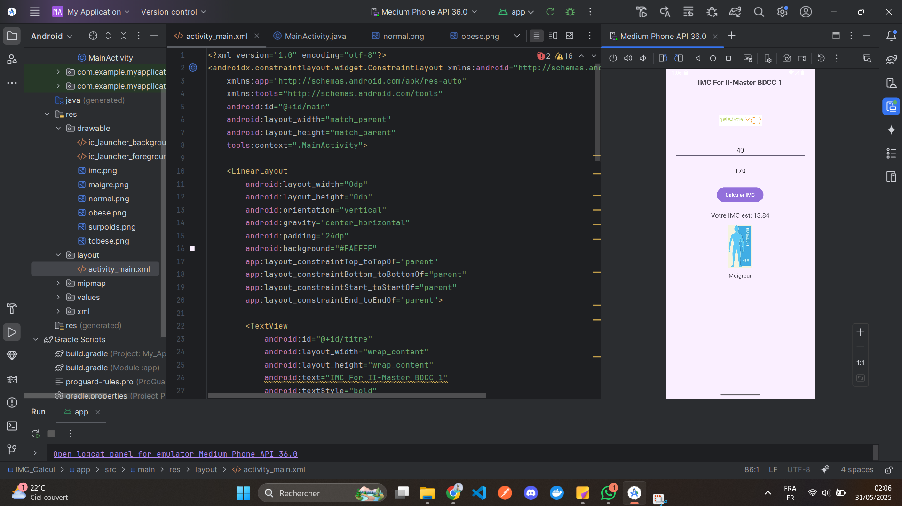
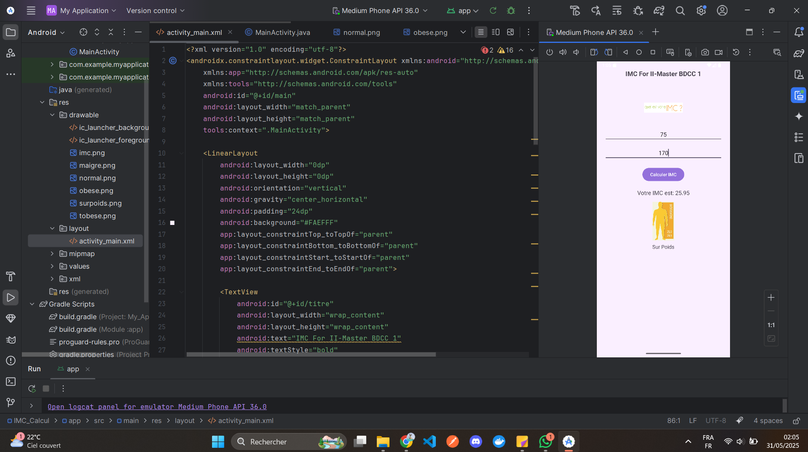

# 📱 Application Android – Calculateur d'IMC

Cette application Android permet de calculer l'**Indice de Masse Corporelle (IMC)** d’un utilisateur à partir de son **poids** et de sa **taille**. Elle affiche ensuite la **catégorie de poids** correspondante, accompagnée d’une **image illustrative**.

---

## 📸 Capture d’écran

| Exemple d'interface (Maigreur) |
|--------------------------------|
|  |

> D'autres images peuvent être ajoutées pour les cas "Surpoids", "Normal", "Obésité", etc.

---

| Exemple d'interface (Poids normal) |
|-----------------------------------|
|  |

---

| Exemple d'interface (SurPoids) |
|-----------------------------------|
|  |

---

## ⚙️ Fonctionnalités

- Entrée du **poids en kilogrammes**
- Entrée de la **taille en centimètres**
- Calcul automatique de l'IMC selon la formule :

  \[
  \text{IMC} = \frac{\text{Poids (kg)}}{\left(\frac{\text{Taille (cm)}}{100}\right)^2}
  \]

- Affichage du **résultat de l’IMC** avec **2 décimales**
- Affichage :
  - de l’**image correspondante** à la catégorie IMC
  - du **texte de la catégorie** (ex: Maigreur, Normal, Surpoids…)

---

## 📊 Catégories d’IMC utilisées

| Catégorie     | IMC           |
|---------------|----------------|
| Maigreur      | < 18.5         |
| Normal        | 18.5 – 24.9    |
| Surpoids      | 25 – 29.9      |
| Obésité       | ≥ 30           |

---

## 🛠️ Technologies utilisées

- **Langage** : Java
- **IDE** : Android Studio
- **Layout** : XML avec `ConstraintLayout` et `LinearLayout`
- **Minimum SDK** : 21 (Android 5.0 Lollipop)

